# Manual do Administrador da Clinica - Podo360

Versao 1.0 - Gerado em 14/07/2026

Este manual e destinado ao administrador da clinica e explica o uso pratico do Podo360 Clinica.

> Observacao: prints com dados de usuarios foram sanitizados. O manual nao contem senhas, tokens nem dados reais de pacientes.

## Apresentacao do Podo360
O Podo360 organiza a rotina clinica de podologia em um unico ambiente: pacientes, abertura de atendimento, BA, Prontuario de Evolucao, anamnese, agenda, imagens, relatorios, financeiro, estoque e usuarios da clinica. Este manual foi escrito para o administrador da clinica, que configura o sistema e apoia a equipe no uso diario.

## Acesso ao sistema
Use o e-mail e a senha cadastrados para entrar. Cada pessoa deve usar seu proprio login. Ao sair, clique em Sair no menu lateral para encerrar a sessao com seguranca.

## Dashboard
O Dashboard apresenta uma visao rapida da operacao: pacientes, agendamentos, atendimentos, recorrencia, financeiro e estoque. Use os filtros de periodo para acompanhar o movimento da clinica.

## Pacientes
A tela Pacientes permite pesquisar, cadastrar e acessar historicos. Confira nome, telefone, data de nascimento e documento antes de salvar. Evite duplicidade consultando o paciente antes de criar novo cadastro.

## Abertura de atendimento
A Abertura de atendimento e o ponto inicial da recepcao. Nela voce seleciona ou cadastra o paciente, confirma dados essenciais, gera o BA e coloca o atendimento na fila.

## Atendimento
A tela Atendimento lista os BAs em andamento e permite continuar o atendimento clinico. O profissional acessa o prontuario, registra anamnese, imagens e finaliza quando o atendimento estiver completo.

## Anamnese
A anamnese e modular. Preencha cada modulo com calma, salve as informacoes e revise antes de finalizar. Os dados alimentam o historico do paciente e os relatorios.

- **Identificacao:** Confere dados basicos do paciente e do atendimento.
- **Queixa principal:** Registra o motivo informado pelo paciente.
- **Medicamentos:** Marque se usa medicamentos e descreva quando necessario.
- **Historico de Saude:** Registra condicoes, alergias, cirurgias e historico relevante.
- **Avaliacao Podal:** Organiza observacoes dos pes e sinais avaliados.
- **Edema:** Registra presenca e grau quando aplicavel.
- **Avaliacao de Sensibilidade:** Permite avaliar pe direito e esquerdo separadamente.
- **ITB:** Indice tornozelo-braco, quando utilizado pela clinica.
- **IHB:** Indice halux-braco, quando utilizado pela clinica.
- **Glicemia:** Registro de valor e observacoes quando aplicavel.
- **Escala de EVA:** Registra intensidade de dor percebida.
- **Diagnostico Ungueal:** Apoia registro de alteracoes de unha, graus e observacoes.
- **Procedimento:** Descreve tecnicas e itens realizados.
- **Curativo:** Registra materiais e conduta.
- **Indicacao de tratamento:** Registra laser, LED, alta frequencia, eletrocauterizacao e parametros.
- **Orientacoes Home Care:** Instrui cuidados para casa.
- **Evolucao por Imagem:** Anexa imagens de acompanhamento quando necessario.
- **Comparativo de Evolucao:** Ajuda a comparar imagens e evolucao entre atendimentos.
- **Retorno:** Registra data sugerida, se retornou e observacoes.

## Prontuario de Evolucao
O Prontuario de Evolucao acompanha o paciente ao longo dos atendimentos. Ele e vinculado ao paciente e aos BAs, permitindo consultar historico, imagens e evolucao clinica.

## Gerenciamento de Atendimento
Use esta area para acompanhar status, finalizar, revisar e reabrir atendimentos quando necessario. Reaberturas devem ter justificativa, pois fazem parte da auditoria da clinica.

## Relatorios
Os relatorios consolidam dados clinicos e operacionais. Revise o conteudo antes de imprimir, salvar PDF ou enviar a terceiros.

## Agenda Clinica
A agenda permite visualizar compromissos, cadastrar horarios e acompanhar status como agendado, confirmado, chegou, falta ou cancelado.

## Usuarios e Funcionarios
O administrador da clinica pode convidar usuarios, definir perfil, permitir abas e inativar acessos. Use perfis adequados para reduzir riscos e manter rastreabilidade.

## Configuracoes da clinica
Em Configuracoes, ajuste identidade visual, logo, cores e dados comerciais exibidos no sistema.

## Financeiro, Estoque e Autoclave
Essas areas ajudam no controle operacional: lancamentos financeiros, produtos, estoque baixo e registros de esterilizacao/autoclave.

## Uploads e imagens
Use imagens apenas quando forem relevantes ao atendimento. Evite fotos com dados desnecessarios e confira se o arquivo certo foi anexado antes de salvar.

## Permissoes e seguranca
Cada usuario deve ter login proprio. Nao compartilhe senha. Inative usuarios que sairam da equipe e revise permissoes periodicamente.

## Duvidas frequentes
Esta secao resume situacoes comuns: esquecimento de senha, link expirado, BA duplicado, paciente nao encontrado, limite de usuarios e relatorio que nao abriu.

- **Nao consigo entrar:** Verifique e-mail e senha. Se a mensagem indicar clinica indisponivel, acione o responsavel da plataforma.
- **O link expirou:** Peca ao administrador da clinica para reenviar o convite ou redefinicao de senha.
- **Paciente nao aparece:** Revise filtros e grafia. Cadastros pertencem apenas a clinica atual.
- **BA duplicado:** Finalize ou reabra corretamente o BA em aberto antes de criar outro para o mesmo paciente.
- **Nao consigo criar usuario:** Confira limite de usuarios, e-mail valido e permissao de administrador da clinica.
- **Limite de usuarios atingido:** Inative usuarios que nao usam mais o sistema ou solicite aumento de limite.
- **Relatorio nao abriu:** Verifique se ha paciente/atendimento selecionado e tente novamente.
- **Upload falhou:** Confirme formato, tamanho do arquivo e conexao. Use PNG, JPG, WEBP ou SVG para logo.

## Suporte
Ao acionar suporte, informe seu nome, clinica, tela usada, horario aproximado, o que tentou fazer e uma captura da mensagem exibida.

## Glossario
BA significa Boletim de Atendimento. Prontuario de Evolucao e o historico evolutivo do paciente. Finalizacao bloqueia edicao ate reabertura autorizada. Clinica suspensa tem acesso temporariamente indisponivel.

## Botoes importantes

- **Entrar:** Acessa o sistema com e-mail e senha.
- **Sair:** Encerra a sessao atual.
- **Novo paciente / Criar paciente:** Inicia cadastro de paciente.
- **Salvar:** Grava as informacoes preenchidas.
- **Cancelar:** Fecha a acao sem salvar.
- **Abrir BA:** Cria boletim de atendimento para o paciente.
- **Continuar atendimento:** Abre atendimento em andamento.
- **Proximo / Avancar:** Vai para o proximo modulo da anamnese.
- **Voltar:** Retorna para etapa anterior.
- **Finalizar atendimento:** Conclui o atendimento e bloqueia edicao.
- **Reabrir:** Cancela finalizacao com justificativa.
- **Gerar relatorio:** Monta relatorio conforme filtros.
- **Imprimir:** Abre a impressao do navegador.
- **Exportar / Salvar PDF:** Gera arquivo para guardar ou compartilhar.
- **Upload / Enviar imagem:** Anexa logo ou imagem de evolucao.
- **Criar usuario:** Convida novo funcionario da clinica.
- **Resetar senha:** Envia instrucao de redefinicao ao usuario.
- **Inativar / Reativar:** Bloqueia ou libera acesso de funcionario.

## Prints capturados

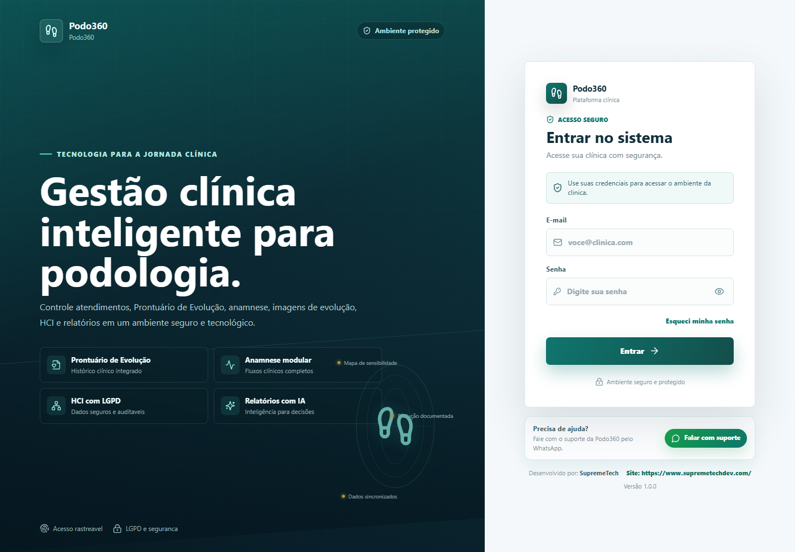
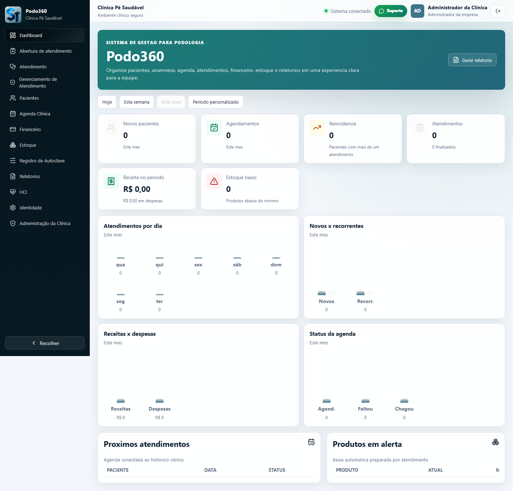
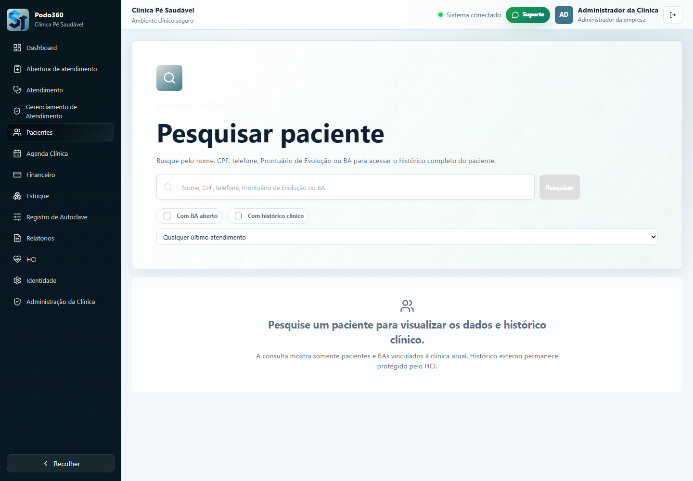

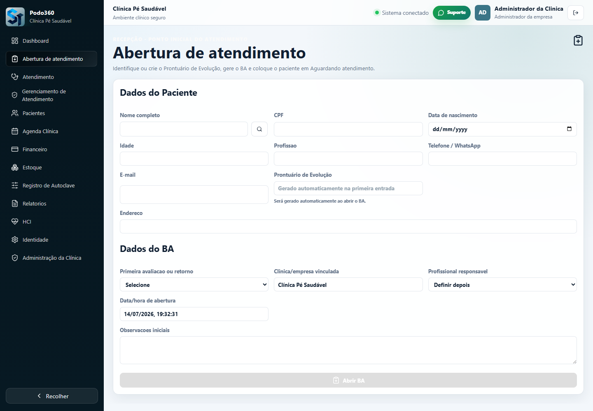
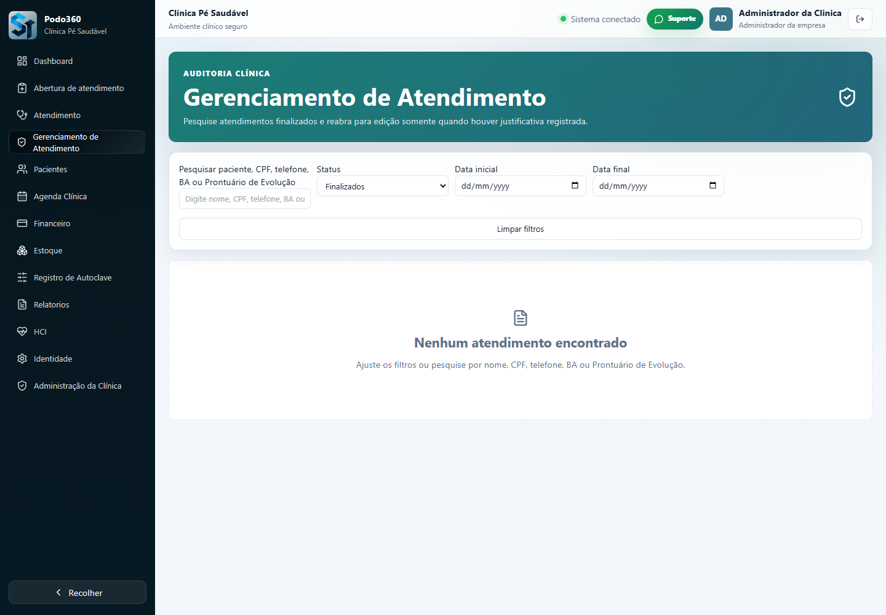
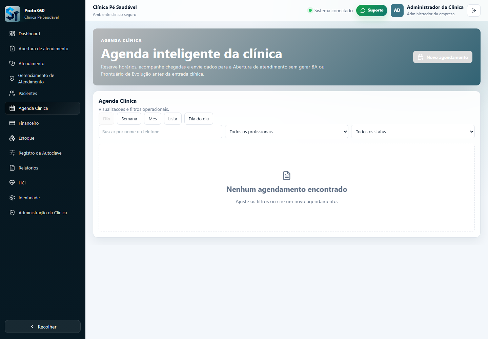
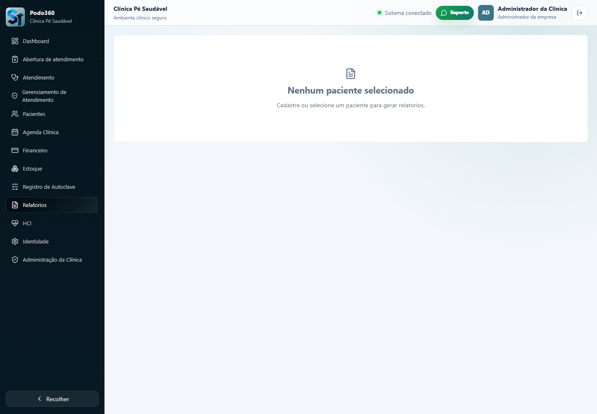
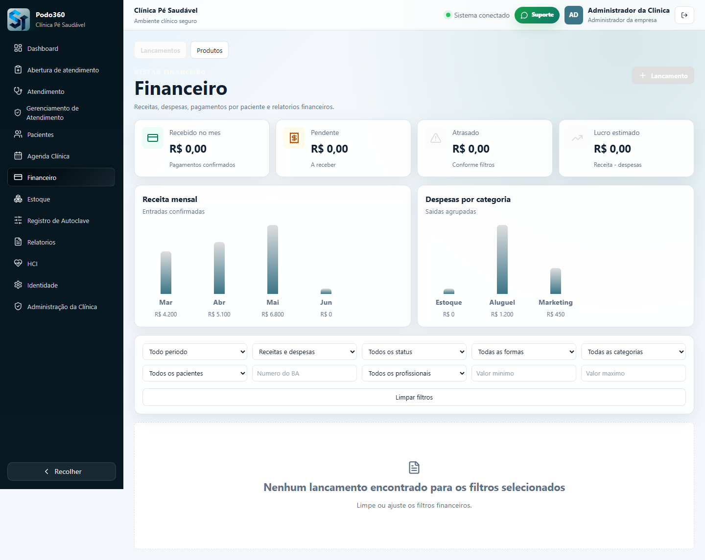
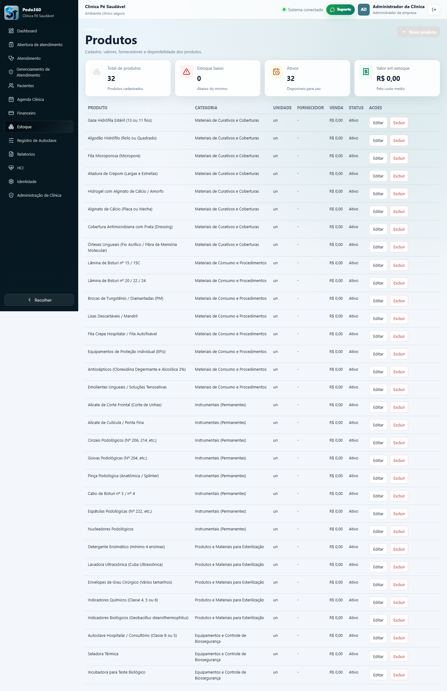
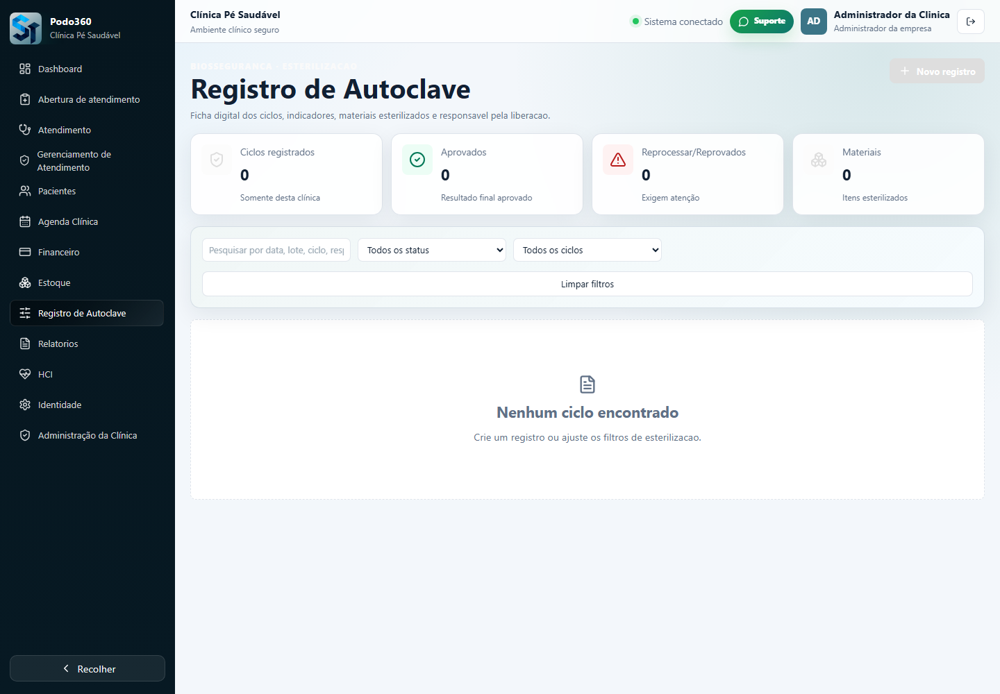
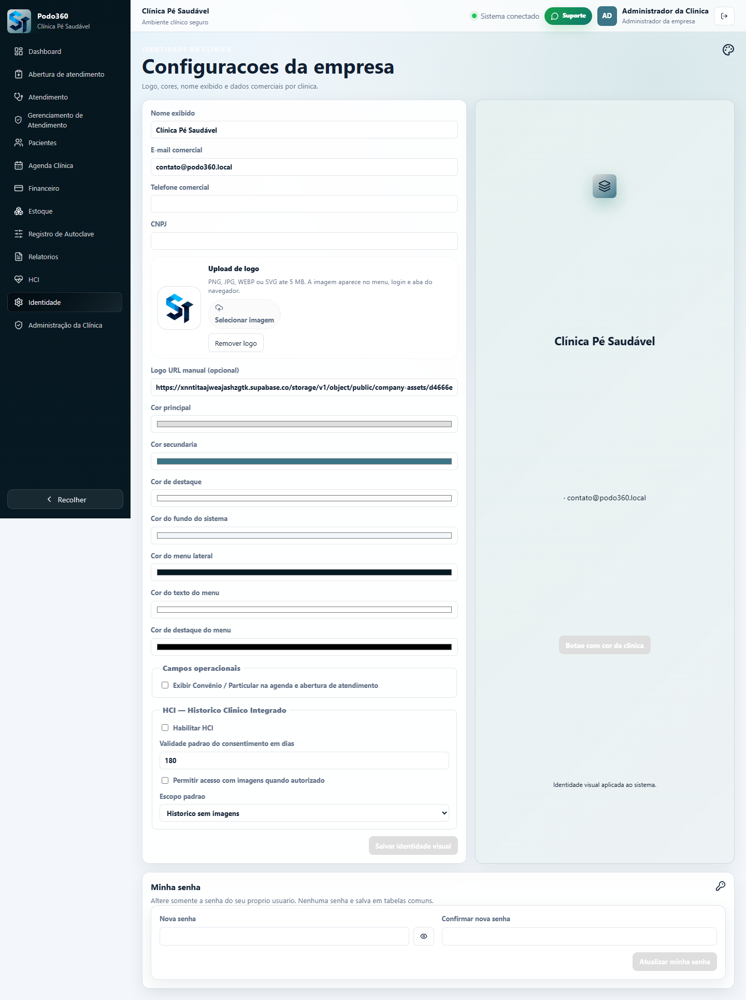
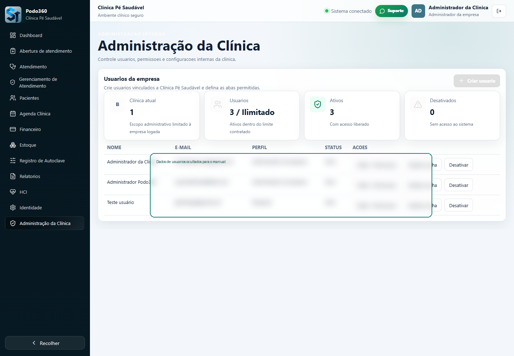